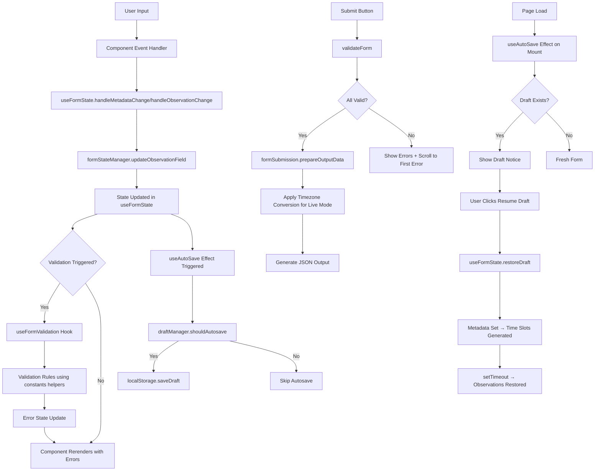

# Architecture Documentation

> **Last Updated**: November 22, 2025 (Post-Phase 6 + Loading Indicators)
> **Codebase Size**: ~3,400 lines (source) + 5,600 lines (tests)
> **Test Count**: 353 passing tests across 18 test suites
> **Components**: 13 React components (4 main + 7 form fields + 2 loading components)
> **Services**: 4 pure function modules (formStateManager, formSubmission, draftManager, excelGenerator)
> **Hooks**: 3 custom hooks (useFormValidation, useFormState, useAutoSave)
> **Recent Changes**: Added accessible loading indicators for async operations

---

## Table of Contents

1. [High-Level Overview](#high-level-overview)
2. [Component Hierarchy](#component-hierarchy)
3. [Data Flow](#data-flow)
4. [File Organization & Metrics](#file-organization--metrics)
5. [State Management](#state-management)
6. [Validation Architecture](#validation-architecture)
7. [Key Architectural Decisions](#key-architectural-decisions)
8. [Patterns & Conventions](#patterns--conventions)

---

## High-Level Overview

WBS Ethogram Form is a **client-side single-page application** (SPA) with no backend. All state lives in React, with localStorage providing autosave functionality. The architecture prioritizes:

- **Data quality**: Centralized validation prevents bad data entry
- **User experience**: Real-time validation, autosave, mobile-friendly
- **Maintainability**: Clear separation of concerns, testable utilities
- **Simplicity**: No state management library needed, vanilla React state works well

### Tech Stack

- **React 18.2** - UI framework with hooks
- **Vite 5.0** - Build tool and dev server
- **React Select 5.8** - Autocomplete location dropdown
- **Jest + React Testing Library** - Testing framework
- **Native Browser APIs** - localStorage, Intl.DateTimeFormat, navigator.clipboard

---

## Component Hierarchy

### ASCII Tree

```
App.jsx (232 lines) - Root coordinator component
│   Uses: useFormState, useAutoSave, useFormValidation hooks
│   Delegates: Business logic to services, state to hooks
│
├── MetadataSection.jsx (175 lines)
│   ├── Observer name input
│   ├── Date picker
│   ├── Mode selector (live/VOD)
│   ├── Start time input
│   └── End time input
│
├── TimeSlotObservation.jsx (311 lines) [×N instances, one per 5-min slot]
│   ├── BehaviorSelect.jsx (35 lines)
│   ├── LocationInput.jsx (79 lines) [conditional]
│   │   ├── React Select dropdown
│   │   ├── Map button
│   │   └── PerchDiagramModal (owned state)
│   ├── ObjectSelect.jsx (68 lines) [conditional]
│   │   ├── Object dropdown
│   │   └── "Other" text input (conditional)
│   ├── AnimalSelect.jsx (68 lines) [conditional]
│   │   ├── Animal dropdown
│   │   └── "Other" text input (conditional)
│   ├── InteractionTypeSelect.jsx (68 lines) [conditional]
│   │   ├── Interaction Type dropdown
│   │   └── "Other" text input (conditional)
│   ├── DescriptionField.jsx (32 lines) [conditional]
│   ├── NotesField.jsx (25 lines)
│   └── "Copy to next" button
│
├── PerchDiagramModal.jsx (83 lines)
│   ├── NE Half tab + image
│   ├── SW Half tab + image
│   └── Close button
│
├── OutputPreview.jsx (118 lines)
│   ├── LoadingOverlay (during Excel generation)
│   ├── Excel download button with loading state
│   └── JSON display with copy button
│
├── LoadingOverlay.jsx (81 lines) [Modal overlay component]
│   ├── Full-screen backdrop (blocks interaction)
│   ├── LoadingSpinner (presentation mode)
│   └── Body scroll management
│
└── LoadingSpinner.jsx (65 lines) [Reusable spinner component]
    ├── Animated spinner
    ├── Loading message
    └── Accessibility attributes (ARIA)
```

### Component Responsibilities

| Component                 | Purpose               | State             | Props In                                  | Props Out (Callbacks)                |
| ------------------------- | --------------------- | ----------------- | ----------------------------------------- | ------------------------------------ |
| **App**                   | Orchestrator          | All form state    | None                                      | None                                 |
| **MetadataSection**       | Metadata inputs       | None (controlled) | metadata, fieldErrors                     | onMetadataChange, onMetadataValidate |
| **TimeSlotObservation**   | Per-slot container    | None (controlled) | time, observation, errors                 | onChange, onValidate, onCopyToNext   |
| **BehaviorSelect**        | Behavior dropdown     | None (controlled) | value, error                              | onChange                             |
| **LocationInput**         | Location + map        | Modal open state  | value, error, behaviorValue, perchOptions | onChange                             |
| **ObjectSelect**          | Object + "other"      | None (controlled) | value, otherValue, errors                 | onChange, onOtherChange              |
| **AnimalSelect**          | Animal + "other"      | None (controlled) | value, otherValue, errors                 | onChange, onOtherChange              |
| **InteractionTypeSelect** | Interaction + "other" | None (controlled) | value, otherValue, errors                 | onChange, onOtherChange              |
| **DescriptionField**      | Description input     | None (controlled) | value, error                              | onChange                             |
| **NotesField**            | Notes textarea        | None (controlled) | value                                     | onChange                             |
| **PerchDiagramModal**     | Perch map viewer      | Active tab        | isOpen                                    | onClose                              |
| **OutputPreview**         | JSON display          | Download state    | data                                      | None                                 |
| **LoadingOverlay**        | Blocking overlay      | None (controlled) | isVisible, message                        | None                                 |
| **LoadingSpinner**        | Spinner animation     | None (controlled) | message, size, presentationOnly           | None                                 |

---

## Services & Hooks Architecture

### Service Modules (Pure Functions)

Business logic extracted from App.jsx into testable pure functions:

| Service              | Size | Purpose                                       | Key Functions                                                |
| -------------------- | ---- | --------------------------------------------- | ------------------------------------------------------------ |
| **formStateManager** | 97L  | Observation state management                  | `generateObservationsForSlots()`, `updateObservationField()` |
| **formSubmission**   | 50L  | Output data preparation & timezone conversion | `prepareOutputData()`                                        |
| **draftManager**     | 31L  | Autosave decision logic                       | `shouldAutosave()`                                           |
| **excelGenerator**   | 212L | Excel workbook generation & download          | `generateExcelWorkbook()`, `downloadExcelFile()`             |

**Key Benefits:**

- Testable without rendering React components
- Clear single responsibility for each module
- Reusable across the application
- Easy to mock in tests

### Custom Hooks

React state and effects encapsulated into focused hooks:

| Hook                  | Size | Purpose                           | Returns                                                                     |
| --------------------- | ---- | --------------------------------- | --------------------------------------------------------------------------- |
| **useFormState**      | 123L | Form state + time slot management | `{metadata, observations, timeSlots, handlers, resetForm, restoreDraft}`    |
| **useAutoSave**       | 66L  | Draft loading & autosave effects  | `{showDraftNotice, draftTimestamp, handleRestoreDraft, handleDiscardDraft}` |
| **useFormValidation** | 302L | Validation logic + error state    | `{fieldErrors, validateForm, validateSingle*, clear*}`                      |

**Hook Interactions:**

```
App.jsx
├── useFormState()
│   ├── Manages metadata, observations, timeSlots state
│   ├── Triggers time slot generation via useEffect
│   └── Uses formStateManager service for updates
│
├── useAutoSave(metadata, observations, onRestore)
│   ├── Monitors for draft on mount
│   ├── Autosaves via useEffect when data changes
│   └── Uses draftManager.shouldAutosave() for logic
│
└── useFormValidation()
    ├── Validates metadata and observations
    └── Uses constants helpers for requirement checks
```

---

## Data Flow

### Mermaid Diagram



### State Flow Details

1. **User types/selects** → Component's onChange handler fires
2. **onChange handler** calls `App.setMetadata()` or `App.setObservations()`
3. **State updates** → Component rerenders with new value
4. **Validation triggers** (onChange for dropdowns, debounced for text)
5. **Validation hook** reads BEHAVIORS flags + constants
6. **Error state updates** → Errors display in UI
7. **localStorage saves** → Autosave effect runs after state update

---

## File Organization & Metrics

### Source Files Reference

| File                                        | Category  | Purpose                             |
| ------------------------------------------- | --------- | ----------------------------------- |
| `App.jsx`                                   | Component | Root coordinator (uses hooks)       |
| `hooks/useFormState.js`                     | Hook      | Form state + operations             |
| `hooks/useAutoSave.js`                      | Hook      | Draft management + autosave         |
| `hooks/useFormValidation.js`                | Hook      | Centralized validation              |
| `services/formStateManager.js`              | Service   | Observation state logic             |
| `services/formSubmission.js`                | Service   | Output data preparation             |
| `services/draftManager.js`                  | Service   | Autosave decision logic             |
| `components/TimeSlotObservation.jsx`        | Component | Per-slot container                  |
| `components/MetadataSection.jsx`            | Component | Metadata inputs                     |
| `constants/behaviors.js`                    | Config    | BEHAVIORS + helpers                 |
| `utils/timeUtils.js`                        | Utility   | Time operations                     |
| `components/PerchDiagramModal.jsx`          | Component | Perch map modal                     |
| `utils/timezoneUtils.js`                    | Utility   | Timezone conversion                 |
| `components/form/LocationInput.jsx`         | Component | Location select + map               |
| `utils/localStorageUtils.js`                | Utility   | Autosave logic                      |
| `components/form/ObjectSelect.jsx`          | Component | Object dropdown + "other"           |
| `components/form/AnimalSelect.jsx`          | Component | Animal dropdown + "other"           |
| `components/form/InteractionTypeSelect.jsx` | Component | Interaction dropdown + "other"      |
| `constants/interactions.js`                 | Config    | Objects, animals, interaction types |
| `utils/observationUtils.js`                 | Utility   | Observation helpers                 |
| `constants/locations.js`                    | Config    | VALID_PERCHES, TIME_SLOTS           |
| `components/OutputPreview.jsx`              | Component | JSON display                        |
| `components/form/BehaviorSelect.jsx`        | Component | Behavior dropdown                   |
| `components/form/DescriptionField.jsx`      | Component | Description text input              |
| `utils/validators/locationValidator.js`     | Validator | Pure location validation            |
| `components/form/NotesField.jsx`            | Component | Notes textarea                      |
| `utils/debounce.js`                         | Utility   | Debounce function                   |
| `constants/index.js`                        | Export    | Barrel export for constants         |
| `main.jsx`                                  | Entry     | React mount point                   |
| `components/form/index.js`                  | Export    | Barrel export for form components   |
| `utils/validators/index.js`                 | Export    | Barrel export for validators        |

### Test Files

| Test Suite                                       | Coverage                   | Tests |
| ------------------------------------------------ | -------------------------- | ----- |
| `tests/integration/App.test.jsx`                 | Full app integration & E2E | 23    |
| `tests/integration/TimeSlotObservation.test.jsx` | Time slot component        | 37    |
| `tests/integration/FormComponents.test.jsx`      | Form field components      | 42    |
| `tests/integration/MetadataSection.test.jsx`     | Metadata section           | 26    |
| `hooks/__tests__/useFormState.test.js`           | Form state hook            | 14    |
| `hooks/__tests__/useAutoSave.test.js`            | Autosave hook              | 9     |
| `hooks/__tests__/useFormValidation.test.js`      | Validation rules           | 66    |
| `services/__tests__/formStateManager.test.js`    | State management service   | 14    |
| `services/__tests__/formSubmission.test.js`      | Output preparation service | 11    |
| `services/__tests__/draftManager.test.js`        | Draft logic service        | 11    |
| `utils/__tests__/localStorageUtils.test.js`      | localStorage               | 4     |
| `utils/__tests__/timeUtils.test.js`              | Time operations            | 4     |
| `utils/__tests__/timezoneUtils.test.js`          | Timezone logic             | 2     |
| `tests/copyToNextSlot.test.js`                   | Copy to next feature       | 14    |

**Total**: 267 test cases across 14 test suites

### Directory Structure

```
src/
├── components/          # React components (11 files, ~1,000 lines)
│   ├── form/           # Form field components (8 files, ~490 lines)
│   │   ├── BehaviorSelect.jsx
│   │   ├── LocationInput.jsx
│   │   ├── ObjectSelect.jsx
│   │   ├── AnimalSelect.jsx
│   │   ├── InteractionTypeSelect.jsx
│   │   ├── DescriptionField.jsx
│   │   ├── NotesField.jsx
│   │   └── index.js
│   ├── MetadataSection.jsx
│   ├── TimeSlotObservation.jsx
│   ├── PerchDiagramModal.jsx
│   └── OutputPreview.jsx
├── hooks/              # Custom hooks (3 files, ~490 lines)
│   ├── useFormState.js
│   ├── useAutoSave.js
│   ├── useFormValidation.js
│   └── __tests__/
├── services/           # Business logic services (3 files, ~180 lines)
│   ├── formStateManager.js
│   ├── formSubmission.js
│   ├── draftManager.js
│   └── __tests__/
├── utils/              # Utilities (7 files, ~450 lines)
│   ├── timeUtils.js
│   ├── timezoneUtils.js
│   ├── localStorageUtils.js
│   ├── observationUtils.js
│   ├── debounce.js
│   ├── validators/     # Pure validator functions
│   │   ├── locationValidator.js
│   │   └── index.js
│   └── __tests__/
├── constants/          # Domain data modules (4 files, 251 lines)
│   ├── behaviors.js    # BEHAVIORS array + helper functions
│   ├── locations.js    # VALID_PERCHES, TIME_SLOTS
│   ├── interactions.js # Objects, animals, interaction types
│   └── index.js        # Barrel export
├── App.jsx             # Root component (396 lines)
├── App.css             # Component styles
├── index.css           # Global styles
└── main.jsx            # Entry point (10 lines)
```

---

## State Management

### App.jsx State Shape

```javascript
// Metadata state
const [metadata, setMetadata] = useState({
  observerName: '',
  date: today, // YYYY-MM-DD format
  startTime: '', // HH:MM (24-hour)
  endTime: '', // HH:MM (24-hour)
  aviary: "Sayyida's Cove", // Fixed
  patient: 'Sayyida', // Fixed
  mode: 'live', // 'live' or 'vod'
});

// Observations state (object keyed by time strings)
const [observations, setObservations] = useState({
  '15:00': {
    behavior: '',
    location: '',
    notes: '',
    object: '', // For "interacting_object" behavior
    objectOther: '', // When object === "other"
    animal: '', // For "interacting_animal" behavior
    animalOther: '', // When animal === "other"
    interactionType: '', // For "interacting_animal" behavior
    interactionTypeOther: '', // When interactionType === "other"
    description: '', // For behaviors requiring description
  },
  '15:05': {
    /* ... */
  },
  // ... one entry per 5-minute slot
});

// Validation errors (flat object with dot-notation keys)
const [fieldErrors, setFieldErrors] = useState({
  observerName: '', // Metadata errors use field name
  date: '',
  startTime: '',
  endTime: '',
  '15:00_behavior': '', // Observation errors use time_field format
  '15:00_location': '',
  '15:05_object': '',
  // ... etc
});
```

### Why This Structure?

**Observations keyed by time strings:**

- ✅ Easy lookup: `observations[time]`
- ✅ Natural ordering (time strings sort correctly)
- ✅ Unique keys (no duplicates possible)
- ✅ Simple iteration: `Object.entries(observations)`

**Flat observation structure (not nested):**

- ✅ Simpler Excel export (each field → one column)
- ✅ Easier validation (flat error keys)
- ✅ Consistent with location field pattern
- ❌ More fields at top level (trade-off accepted)

**Error keys with time prefix:**

- ✅ Unique keys per slot and field
- ✅ Easy to clear errors for a specific slot
- ✅ Simple lookup: `fieldErrors[${time}_${field}]`

---

## Validation Architecture

### Centralized Hook: `useFormValidation.js`

The validation hook is the **single source of truth** for all validation rules.

**Exposed Methods:**

```javascript
const {
  validateForm, // Validates entire form, returns boolean
  validateSingleMetadataField, // Validates one metadata field
  validateSingleObservationField, // Validates one observation field
  clearFieldError, // Clears error for one field
  clearAllErrors, // Clears all errors
} = useFormValidation(metadata, observations, setFieldErrors);
```

### Validation Patterns

**Metadata fields**: Validate on blur or onChange
**Behavior/Location dropdowns**: Validate immediately onChange
**Text inputs** (objectOther, animalOther, description): **Debounced** validation (200ms delay)

### Why Debounced Text Validation?

**Problem**: Validating on every keystroke causes flickering errors while typing
**Solution**: Wait 200ms after user stops typing before validating
**Implementation**: `debounce` utility wraps validation calls in TimeSlotObservation.jsx

### Conditional Validation

Validation rules are **dynamic** based on behavior selection:

```javascript
// In constants/behaviors.js
BEHAVIORS = [
  {
    value: 'interacting_object',
    label: 'Interacting with Inanimate Object',
    requiresLocation: false,
    requiresObject: true, // ← Triggers object validation
    requiresAnimal: false,
  },
  // ...
];

// Helper functions in constants/behaviors.js
export const requiresObject = (behaviorValue) =>
  getBehaviorByValue(behaviorValue)?.requiresObject || false;

// In useFormValidation.js (refactored in Phase 4/5)
if (requiresObject(observation.behavior) && !observation.object) {
  errors[`${time}_object`] = 'Object is required';
}

if (observation.object === 'other' && !observation.objectOther.trim()) {
  errors[`${time}_objectOther`] = 'Please specify the object';
}
```

### Validation Flow

1. User changes behavior → `onChange` fires
2. Behavior value updates in state
3. `onValidate` called immediately
4. Hook checks `requiresObject` flag from BEHAVIORS
5. If true, validates `object` field
6. If `object === "other"`, validates `objectOther` field
7. Errors set/cleared in `fieldErrors` state
8. Component rerenders with error messages

---

## Loading Indicators & Async Operation Feedback

### Architecture Overview

The application provides accessible, user-friendly loading feedback during asynchronous operations using two reusable components:

1. **LoadingSpinner** - Visual spinner with ARIA support
2. **LoadingOverlay** - Full-screen modal overlay that blocks interaction

### LoadingSpinner Component

**Purpose**: Reusable loading spinner with comprehensive accessibility support

**Features**:

- ARIA attributes (role="status", aria-live="polite", aria-busy="true")
- Customizable size (small, medium, large)
- Presentation mode for use inside other status containers
- Reduced motion support (slower animation for users with motion sensitivity)
- High contrast mode support
- Dark mode support

**Props**:

```javascript
{
  message: string,              // Loading message (default: "Loading...")
  size: 'small' | 'medium' | 'large', // Spinner size
  presentationOnly: boolean,    // Removes ARIA status role when inside other status containers
  className: string             // Additional CSS classes
}
```

**Usage Example**:

```javascript
// Standalone with full ARIA
<LoadingSpinner message="Processing data..." size="medium" />

// Inside another status container (presentation only)
<LoadingSpinner message="Generating..." size="large" presentationOnly={true} />
```

### LoadingOverlay Component

**Purpose**: Full-screen blocking overlay for long-running async operations

**Features**:

- Blocks user interaction during async operations
- Prevents body scroll
- Full accessibility (role="status", aria-live="assertive", aria-modal="true")
- Click-through prevention
- Automatic cleanup on unmount
- Responsive design with mobile support

**Props**:

```javascript
{
  isVisible: boolean,    // Controls overlay visibility
  message: string        // Loading message to display
}
```

**When to Use LoadingOverlay**:

- Operations that take >500ms (e.g., Excel file generation)
- Operations that could fail if user interacts during processing
- Downloads on slow connections (satellite internet, 3G, etc.)
- File generation that blocks the main thread

**Usage Example**:

```javascript
const [isGenerating, setIsGenerating] = useState(false);

const handleGenerate = async () => {
  setIsGenerating(true);
  try {
    await generateLargeFile();
  } finally {
    setIsGenerating(false);
  }
};

return (
  <>
    <LoadingOverlay isVisible={isGenerating} message="Generating file..." />
    <button onClick={handleGenerate}>Generate</button>
  </>
);
```

### Current Implementation: Excel Download

**Location**: OutputPreview component

**Flow**:

1. User clicks "Download Excel File" button
2. Button text changes to "Generating..." and becomes disabled
3. LoadingOverlay appears with "Generating Excel file..." message
4. Excel file is generated asynchronously (could take time on slow connections)
5. File downloads automatically
6. Overlay disappears and button re-enables

**Why This Matters**:

- Prevents double-clicks during slow operations
- Provides clear feedback on slow connections (satellite, 3G)
- Accessible to screen reader users (assertive announcements)
- Professional UX that matches native apps

### Accessibility Design Decisions

**1. Different aria-live Levels**:

- LoadingSpinner: `aria-live="polite"` (non-intrusive for inline spinners)
- LoadingOverlay: `aria-live="assertive"` (immediate announcement for blocking operations)

**2. Presentation Mode**:

- LoadingSpinner can disable ARIA attributes when inside LoadingOverlay
- Prevents duplicate role="status" (causes accessibility issues)
- Overlay handles screen reader announcements, spinner is purely visual

**3. Body Scroll Management**:

- Overlay sets `document.body.style.overflow = 'hidden'` when visible
- Prevents background scrolling while overlay is active
- Restores original overflow value on cleanup
- Handles rapid show/hide toggles gracefully

**4. Keyboard & Focus**:

- Overlay is modal (aria-modal="true")
- Focus management handled by browser (backdrop prevents focus escape)
- No keyboard trap needed (operation is temporary)

### Testing Strategy

**Component Tests** (46 tests):

- LoadingSpinner: ARIA attributes, visual presentation, size variants
- LoadingOverlay: Body scroll management, click blocking, ARIA attributes

**Integration Tests** (19 tests):

- OutputPreview: Download flow, loading states, error handling
- App: End-to-end Excel download with overlay

**Accessibility Tests**:

- Screen reader announcements (role, aria-live, aria-label)
- Keyboard navigation (button states, disabled handling)
- High contrast mode compatibility
- Reduced motion support

---

## Key Architectural Decisions

### 1. No Backend / Client-Only

**Decision**: Build as pure client-side SPA, no server required

**Rationale**:

- Reduces hosting costs (static hosting is free/cheap)
- Simplifies deployment (just upload HTML/JS/CSS)
- No backend maintenance burden
- Faster development (no API layer needed)
- Works offline (after initial load)

**Trade-offs**:

- ❌ Can't enforce data validation server-side
- ❌ Can't aggregate/analyze data centrally (yet)
- ❌ User must manually copy/paste JSON output
- ✅ Will add Excel export + email in future (can still be client-side)

### 2. localStorage for Autosave

**Decision**: Use browser localStorage for draft persistence

**Rationale**:

- ✅ No server needed
- ✅ Automatic draft recovery if tab closes
- ✅ Works offline
- ✅ Simple API

**Trade-offs**:

- ❌ Data is device-specific (can't sync across devices)
- ❌ Clearing browser data loses drafts
- ✅ Acceptable for single-session data entry

### 3. Flat Observation Structure

**Decision**: All fields at top level, not nested (see interaction-subfields-design.md)

**Alternative considered**: Nested structure like:

```javascript
{
  behavior: 'interacting_object',
  interaction: {
    object: 'newspaper',
    objectOther: ''
  }
}
```

**Why flat won**:

- Excel export is way simpler (each field = one column)
- Validation logic is simpler (flat error keys)
- Consistent with existing `location` field
- React state updates are simpler

### 4. Controlled Components + Central State

**Decision**: All form state lives in App.jsx, components are fully controlled

**Alternative**: Each TimeSlotObservation manages its own state

**Why centralized won**:

- ✅ Single source of truth
- ✅ Easy to implement "Copy to next" feature
- ✅ Easy to serialize entire form for localStorage
- ✅ Easy to validate entire form at once
- ❌ More prop drilling (acceptable with only 2 levels)

### 5. Custom Validation vs Form Library

**Decision**: Build custom `useFormValidation` hook instead of React Hook Form / Formik

**Rationale**:

- Domain-specific rules (behavior flags, location codes)
- Conditional validation based on behavior selection
- Need tight integration with BEHAVIORS constants
- Learning curve for team not worth it
- Form is simple enough that library overhead not justified

---

## Patterns & Conventions

### 1. Conditional Rendering Pattern

Components check behavior flags to show/hide fields:

```javascript
import { requiresObject } from '../constants';

const showObject = requiresObject(observation.behavior);

{showObject && (
  <div>
    <label>Object *</label>
    <select value={observation.object} onChange={...}>
      {INANIMATE_OBJECTS.map(...)}
    </select>
  </div>
)}
```

### 2. Field Clearing on Behavior Change

When behavior changes, clear all conditional fields to prevent orphaned data:

```javascript
const handleBehaviorChange = (time, value) => {
  setObservations((prev) => ({
    ...prev,
    [time]: {
      ...prev[time],
      behavior: value,
      // Clear all conditional fields
      object: '',
      objectOther: '',
      animal: '',
      animalOther: '',
      interactionType: '',
      interactionTypeOther: '',
      description: '',
    },
  }));
};
```

### 3. Error Key Convention

**Metadata errors**: Just the field name (`observerName`, `date`, etc.)
**Observation errors**: `${time}_${field}` format (`"15:05_behavior"`, `"15:10_location"`)

This allows easy clearing of all errors for a specific slot:

```javascript
// Clear all errors for time slot "15:05"
const newErrors = Object.fromEntries(
  Object.entries(fieldErrors).filter(([key]) => !key.startsWith('15:05_'))
);
```

### 4. Time String Format

**Stored as**: 24-hour "HH:MM" strings (`"15:05"`, `"09:30"`)
**Displayed as**: 12-hour format via `formatTo12Hour()` (`"3:05 PM"`, `"9:30 AM"`)

**Why 24-hour storage?**

- ✅ Natural sorting (Object.keys sort correctly)
- ✅ No AM/PM ambiguity
- ✅ HTML `<input type="time">` uses 24-hour
- ✅ Easy to convert for display

### 5. Constants as Single Source of Truth

Domain data lives in modular `constants/` directory (Phase 4/5 refactoring):

**`constants/behaviors.js`:**

- `BEHAVIORS` - List of observable behaviors with feature flags
- Helper functions: `requiresLocation()`, `requiresObject()`, `requiresAnimal()`, etc.
- `getBehaviorByValue()` - Lookup function

**`constants/locations.js`:**

- `VALID_PERCHES` - Valid location codes (1-31 as integers, plus 'BB1', 'BB2', 'F1', 'F2', 'G', 'W' as strings)
- `TIME_SLOTS` - Time slot intervals

**Note on Ground Location:** The "Ground" location is **not** in `VALID_PERCHES`. It's added dynamically in `TimeSlotObservation.jsx`'s `perchOptions` array and validated separately in `locationValidator.js` (line 21). This separates the numbered perches/special codes from the common "Ground" location in the UI.

**`constants/interactions.js`:**

- `INANIMATE_OBJECTS` - Object dropdown options
- `ANIMAL_TYPES` - Animal dropdown options
- `INTERACTION_TYPES` - Interaction type dropdown options

**`constants/index.js`** - Barrel export for clean imports

**Pattern**: UI and validation both use helper functions and constants, ensuring consistency

### 6. Debounced Text Validation

For text inputs that users type in (not dropdowns):

```javascript
const debouncedValidateRef = useRef(
  debounce((time, field, value) => {
    onValidate(time, field, value);
  }, 200)
);

const handleTextChange = (e) => {
  const value = e.target.value;
  onChange(time, field, value); // Update state immediately
  debouncedValidateRef.current(time, field, value); // Validate after 200ms
};
```

**Why?** Prevents flickering error messages while user is still typing.

### 7. Enter Key Handling

Text inputs validate on Enter but **do not submit** the form:

```javascript
const handleKeyDown = (e) => {
  if (e.key === 'Enter') {
    e.preventDefault(); // Prevent form submission
    onValidate(time, field, e.target.value); // Validate this field
  }
};
```

**Why?** Prevents accidental form submission on mobile when user taps "Enter" on keyboard.

---

## Future Architectural Considerations

### When Might We Need State Management Library?

Consider Redux/Zustand if:

- Form becomes multi-page with complex navigation
- Need to share observation data across multiple views
- Need time-travel debugging for complex interactions
- Team grows and needs more structured state

**Current verdict**: Not needed yet, vanilla React is sufficient

### When Might We Need TypeScript?

Consider TypeScript if:

- Team grows beyond 1-2 developers
- Refactoring becomes risky due to prop mismatches
- IDE autocomplete becomes important
- Need compile-time safety for complex data transformations

**Current verdict**: PropTypes (Phase 1) might be sufficient, TypeScript deferred

### When Might We Need Backend?

Consider adding a backend if:

- Need to aggregate data from multiple observers
- Want to provide data analysis dashboard
- Need to enforce server-side validation
- Want to send automated email submissions
- Need multi-device sync

**Current verdict**: Client-side Excel generation + email integration (Phase 6) might be sufficient

---

## Performance Characteristics

### Current Performance (Measured)

- **Initial load**: < 1 second
- **Form renders**: No noticeable lag
- **Validation**: Instantaneous for dropdowns, 200ms for text
- **Time slot generation**: Instantaneous (max 12 slots)
- **localStorage autosave**: < 10ms

### No Performance Issues Because:

- ✅ Only 12 TimeSlotObservation components max (60 min range)
- ✅ No complex computations or large datasets
- ✅ Debouncing prevents excessive validation calls
- ✅ React Select handles large dropdown lists efficiently
- ✅ No unnecessary rerenders (components are well-memoized by React)

### If Performance Becomes an Issue:

- Consider `React.memo()` for TimeSlotObservation
- Consider `useMemo()` for perchOptions generation
- Consider virtualizing long time ranges (if >60 min support added)

**Current verdict**: No optimizations needed, form is performant

---

## Related Documentation

- **[README.md](README.md)** - User-facing documentation
- **[DEVELOPMENT.md](DEVELOPMENT.md)** - Developer setup and workflow
- **[CONTRIBUTING.md](CONTRIBUTING.md)** - Contribution guidelines
- **[docs/interaction-subfields-design.md](docs/interaction-subfields-design.md)** - Design decisions for interaction fields
- **[docs/refactoring-history.md](docs/refactoring-history.md)** - Completed refactoring phases (historical reference)
- **[docs/maintenance-strategy.md](docs/maintenance-strategy.md)** - Dependency and security maintenance
- **[docs/quality-improvements.md](docs/quality-improvements.md)** - Testing, accessibility, and governance improvements
- **[docs/testing-checklist.md](docs/testing-checklist.md)** - QA checklist
- **[.github/copilot-instructions.md](.github/copilot-instructions.md)** - AI assistant quick reference

---

## Maintenance Notes

### Keep This Document Updated When:

- Adding new components
- Changing state structure
- Adding new validation patterns
- Making architectural decisions
- File sizes change significantly (±50 lines)
- Test count changes significantly

### Document Owner

This is a living document. Keep it accurate and up-to-date as the codebase evolves.

**Last audit**: November 21, 2025 (Phase 0 refactoring)
